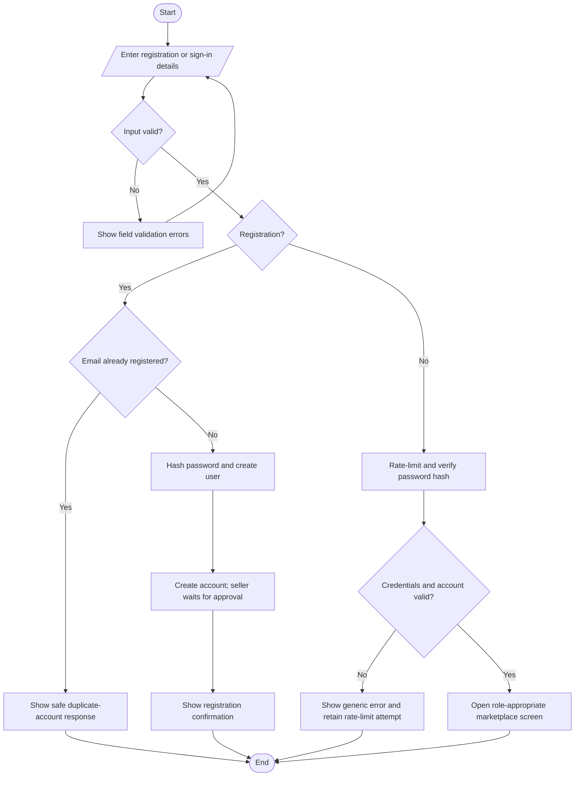
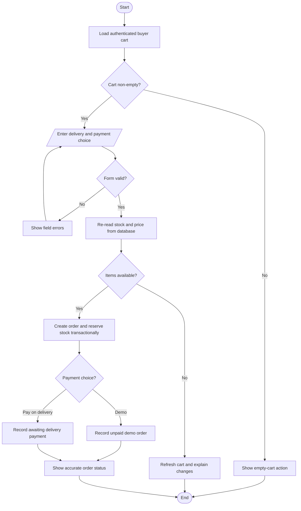
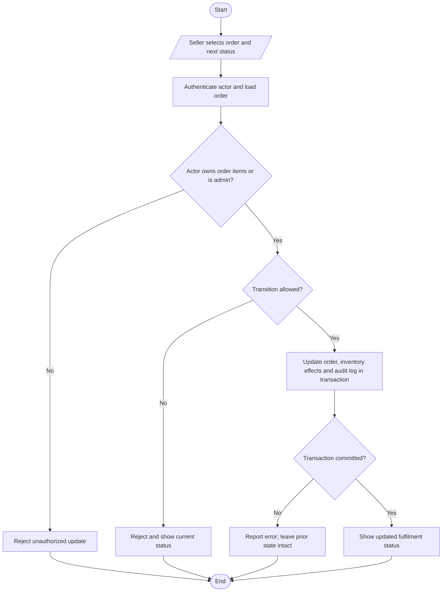
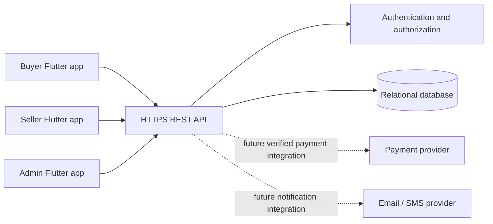
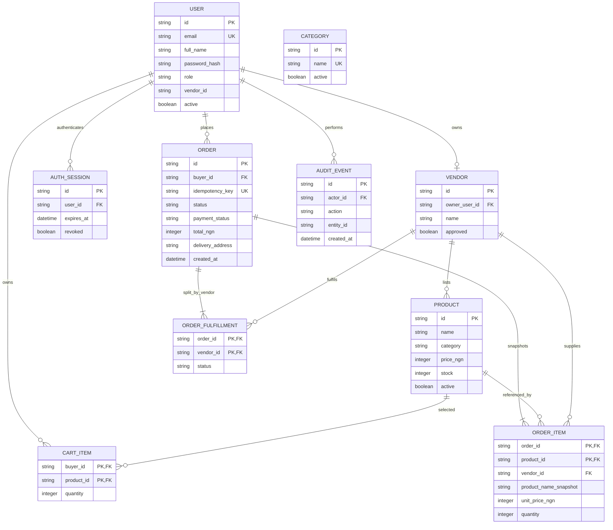

# PharmaGo Pharmacy Marketplace — Project Report

**Project type:** Academic pharmacy marketplace prototype  
**Client target:** Flutter application for web, Windows, Linux, macOS, Android and iOS  
**Market:** Pharmacy and personal-care products in Gombe, Nigeria  
**Currency:** Nigerian naira (NGN)  
**Evidence status:** Requirements derived from the supplied brief and inspection of the existing PharmaGo storefront. Stakeholder interviews and questionnaires have not yet been conducted. Production payment and deployment credentials have not been supplied.

## 1. Executive summary

PharmaGo is a working two-sided pharmacy marketplace prototype. Buyers discover pharmacy and personal-care products, keep a server-backed cart, submit orders and review their order status. Approved sellers manage their own listings and fulfilment updates. Administrators manage accounts, catalogue quality and marketplace operations.

The architecture uses one Flutter/Dart client codebase for web, desktop and mobile targets, plus a Dart REST API and SQLite development database. A trusted server is required for identity, access control, inventory and orders. This prototype offers only unpaid demo and pay-on-delivery order states; it has no live payment integration.

## 2. Feasibility study

| Area | Finding | Conditions and risks |
|---|---|---|
| Technical | Implemented as a Flutter/Dart client, Dart Shelf REST API and SQLite development database. | Android/iOS builds also need platform SDKs and, for iOS signing, macOS/Xcode. Windows/Linux/macOS builds need host toolchains. Production hosting, database migrations, monitoring, backups, security review and target-device verification remain necessary. |
| Economic | A student prototype can use open-source development tools and local test data at little direct software cost. | Hosting, a production database, domain/TLS, transactional messaging, backups, payment-provider fees, maintenance and compliance work have ongoing costs. Obtain local cost estimates before launch. |
| Operational | The existing storefront indicates an initial product-browsing and Gombe-delivery workflow. A marketplace is operationally plausible if buyers, licensed sellers and a support/pharmacy team agree on listing and fulfilment processes. | No stakeholder acceptance study has been performed. Confirm seller onboarding, stock accuracy, returns, prescription handling, service areas, support ownership and staff training with actual participants. |
| Legal | A pharmacy marketplace can be designed to minimize personal data, use a regulated payment provider and restrict product categories. | Before launch obtain qualified Nigerian legal/compliance advice on the Nigeria Data Protection Act and NDPC obligations, pharmacy premises/professional licensing, NAFDAC product rules, prescription-only medicines, consumer protection, tax, records retention, cross-border data handling and payment-provider/PCI scope. This report is not legal advice. |
| Schedule | A staged prototype has been implemented: Flutter client, catalogue, identity, cart, transactional orders, seller and admin workflows. | No submission date or team size was provided. Estimates must be adjusted after the project supervisor confirms scope and platform requirements. Remaining stakeholder validation, platform builds, production review and store releases require additional time. |

### Indicative schedule

| Phase | Estimate | Exit criterion |
|---|---:|---|
| Stakeholder validation and SRS | 1 week | Approved requirements, roles, pharmacy scope and acceptance tests |
| Architecture and data design | 1 week | Reviewed API, threat model and schema |
| Client and core marketplace API | 2–3 weeks | Catalogue, search, identity, seller listings and buyer cart work end to end |
| Checkout and order fulfilment | 1–2 weeks | Orders are persisted and role-guarded status transitions pass tests |
| Security, usability and platform testing | 1–2 weeks | Test evidence, accessibility pass and supported-target build checks |
| Pilot and final report | 1 week | Stakeholder sign-off, deployment checklist and handover |

## 3. Fact-finding

### Evidence actually gathered

| Technique | Status and evidence | Follow-up |
|---|---|---|
| Observation | Performed on the supplied storefront using source review and browser checks. It has a pharmacy catalogue, category/search filtering, cart, checkout form, product manager stored in browser-local storage, and a demo-only payment selector. | Observe real buyers, sellers and staff performing current purchase, stock and fulfilment tasks. |
| Document analysis | Performed on the supplied project files and the requirements in the project brief. | Obtain approved business rules, product/licence records, refund/returns policy, delivery areas and support scripts. |
| Online research | Performed against the Flutter supported-platform documentation, OWASP Authentication Cheat Sheet and Nigeria Data Protection Commission website; see references. | Check current legislation, regulator guidance, payment provider terms and current platform release requirements before deployment. |
| Interviews | Not performed. No stakeholder or interview records were supplied. | Interview at least one buyer, seller/pharmacist, fulfilment staff member and administrator; document consent, date, role, questions and anonymized findings. |
| Questionnaires | Not distributed. No survey responses were supplied. | Run a short usability and operational survey with target users; report sample size and limitations, and do not invent responses. |

### Interview guide (proposed)

1. How do customers currently find, verify, order and receive pharmacy products?
2. Which products may be listed, and which need pharmacist or prescription review?
3. How do sellers update price, stock and availability?
4. Which delivery areas, fees, cut-off times and proof-of-delivery rules apply?
5. How should cancellation, returns, refunds, complaints and adverse product reports work?
6. Which personal data is necessary, who may access it, and how long is it retained?

### Questionnaire topics (proposed)

Ease of product search; trust and product information; preferred delivery/payment options; accessibility/device constraints; seller listing effort; order status visibility; support and return expectations. Collect only necessary, anonymized responses and disclose the study purpose.

## 4. Software requirements specification

### Actors

- **Buyer:** browses, searches, manages a cart, submits an order and views their own order history.
- **Seller:** manages only their own product listings, stock and fulfilment updates.
- **Administrator:** manages users, seller approval, categories and operational reports.
- **Pharmacist/reviewer (subject to business confirmation):** reviews restricted listings or pharmacy-related escalations.

### Functional requirements

| ID | Requirement |
|---|---|
| FR-01 | The system shall allow users to register and sign in using server-verified credentials, with validated input and salted PBKDF2-HMAC-SHA256 password hashes. |
| FR-02 | The system shall assign buyer, seller and administrator roles and authorize every protected operation on the server. |
| FR-03 | Buyers shall browse, search and filter active listings by name, category and seller. |
| FR-04 | Product detail shall show seller, description, price, pack size, availability and required product warnings. |
| FR-05 | Buyers shall add, remove and change quantities in a cart; the server shall validate product ownership, price and stock at order time. |
| FR-06 | Checkout shall collect a delivery address, show server-calculated item totals and disclose unpaid demo or pay-on-delivery terms before order submission. |
| FR-07 | The system shall create a durable order and immutable order-item price/name snapshot after successful validation. |
| FR-08 | Buyers shall view the status and history of their own orders. |
| FR-09 | Sellers shall create, edit, deactivate and manage stock for their own listings, subject to review rules. |
| FR-10 | Sellers shall update permitted fulfilment states for their own orders; invalid state changes shall be rejected and seller ownership denials logged. |
| FR-11 | Administrators shall approve sellers, moderate listings, manage categories and view operational summaries. |
| FR-12 | Reports shall summarize orders, listing activity and fulfilment without exposing unnecessary personal data. |
| FR-13 | The prototype shall not collect payment credentials or claim payment success; real payment processing is out of scope until a provider and server-side verification are integrated. |
| FR-14 | The system shall provide accessible validation, empty, loading and error states. |

### Non-functional requirements

| ID | Quality attribute | Acceptance target |
|---|---|---|
| NFR-01 | Security | HTTPS in deployment; salted PBKDF2-HMAC-SHA256 hashes; one-hour revocable sessions; role checks on protected API requests; in-memory login throttling; no payment secrets in client code. Production security review and durable distributed rate limiting are still required. |
| NFR-02 | Privacy | Minimize personal data, define retention/deletion, restrict staff access and record consent/notice where required. |
| NFR-03 | Performance | Agree and measure catalogue/search API latency at target pilot load. The current prototype has not been load-tested; local image assets are bundled with the app. |
| NFR-04 | Reliability | Transactions protect stock and order creation; failed operations return explicit errors; backups and restore procedures are tested. |
| NFR-05 | Usability | Responsive, readable workflows; keyboard and screen-reader labels; errors identify the field/action needing correction. |
| NFR-06 | Scalability | Stateless API instances and a managed relational database can scale independently from client platforms. |
| NFR-07 | Maintainability | Feature modules, SQLite schema initialization, automated tests and documented API behavior. Production migrations and independent code review remain required. |
| NFR-08 | Availability | Production SLO and recovery objectives are agreed before launch; prototype availability is best-effort. |
| NFR-09 | Compatibility | Provide Flutter platform scaffolding and build/smoke-test each claimed target with its required host toolchain before release. |

### Hardware and software requirements

- Development: supported Flutter stable SDK with Dart, Git, an IDE, and target-specific SDKs (Android SDK/JDK; Xcode on macOS for iOS; desktop compiler/toolchain on each OS).
- API: supported Dart runtime for the REST service, an SQL database (SQLite for local development; PostgreSQL recommended for deployment), TLS termination, secret management and backups.
- Users: modern Android/iOS phone or supported desktop/web browser and internet access. The web layout must remain usable on narrow viewports.
- Production: managed application hosting, database, monitoring, email/SMS provider if account verification/notifications are enabled, and a contracted payment provider for real payments.

## 5. Algorithms

### Registration and sign-in

1. Accept email, password and requested account type.
2. Normalize and validate email, name and a passphrase of 15–128 characters.
3. Reject duplicate email and disallowed public administrator registration.
4. Hash the password with PBKDF2-HMAC-SHA256 and a randomly generated salt.
5. Persist the user and pending seller record together in a database transaction; public registration cannot create an administrator.
6. On sign-in, apply the in-memory attempt limit, verify the password hash and check account state.
7. Issue a one-hour signed token backed by a revocable server-side session.
8. Return a generic authentication error on failure; never return a password/hash. Email verification, password reset, MFA and durable distributed rate-limiting are not implemented.

### Cart update

1. Receive an authenticated buyer, product ID and requested absolute quantity.
2. Load active product and stock from the server.
3. Reject missing/inactive products, non-integer quantities and quantities above available stock; remove the line when quantity is zero.
4. Persist the cart line and return server-calculated line and cart totals.

### Checkout and order creation

1. Require an authenticated buyer and a delivery address of 5–300 characters, plus an idempotency key.
2. Accept only the explicit unpaid demo or pay-on-delivery choices; no delivery-area pricing is implemented.
3. Begin a SQLite immediate transaction and re-read active product stock and server prices.
4. Reject unavailable or changed items with a cart refresh response.
5. Recalculate totals from trusted server prices and delivery rules; never trust client totals.
6. Create the order, per-vendor fulfilments and immutable item snapshots, decrement stock, clear the cart and record an unpaid payment state atomically.
7. Return the existing order if the buyer retries with the same key; demo orders remain not paid and pay-on-delivery orders await delivery payment.
8. Commit and return a safe order summary; roll back on any failure. No live payment intent is created.

### Order fulfilment update

1. Authenticate the actor and load the requested order fulfilment.
2. Confirm buyer/seller/admin permission for the requested transition.
3. Check the transition against the allowed state machine and reject stale or prohibited changes.
4. In one transaction, update the vendor's fulfilment, restore stock if that fulfilment is cancelled, aggregate order status and record an audit event.
5. Return the new fulfilment status. Buyer notifications are not implemented.

## 6. Flowcharts

### Registration/sign-in



### Checkout



### Order fulfilment



## 7. Pseudocode

### Register / sign in

```text
FUNCTION authenticate(action, fullName, email, password, requestedRole)
    normalizedEmail <- NORMALIZE_EMAIL(email)
    IF NOT VALID_EMAIL(normalizedEmail) OR NOT VALID_NAME(fullName) OR
       LENGTH(password) < 15 OR LENGTH(password) > 128 THEN
        RETURN VALIDATION_ERROR
    END IF
    IF action = REGISTER THEN
        IF requestedRole NOT IN {BUYER, SELLER} OR USER_EXISTS(normalizedEmail) THEN
            RETURN SAFE_REGISTRATION_ERROR
        END IF
        passwordHash <- PBKDF2_HMAC_SHA256(password, RANDOM_SALT)
        CREATE_USER_AND_PENDING_VENDOR_TRANSACTIONALLY(normalizedEmail, passwordHash)
        RETURN REGISTRATION_CONFIRMATION
    END IF
    APPLY_RATE_LIMIT(normalizedEmail)
    user <- FIND_USER(normalizedEmail)
    IF user is absent OR user.disabled OR NOT VERIFY_HASH(password, user.passwordHash) THEN
        RETURN GENERIC_AUTH_ERROR
    END IF
    RETURN SIGNED_TOKEN_AND_REVOCABLE_SESSION(user.id, ONE_HOUR)
END FUNCTION
```

### Cart update

```text
FUNCTION updateCart(buyerId, productId, requestedQuantity)
    REQUIRE_AUTHENTICATED_BUYER(buyerId)
    REQUIRE_NON_NEGATIVE_INTEGER(requestedQuantity)
    product <- LOAD_ACTIVE_PRODUCT(productId)
    IF product is absent THEN RETURN PRODUCT_UNAVAILABLE
    IF requestedQuantity > product.stock THEN RETURN QUANTITY_ERROR
    IF requestedQuantity = 0 THEN DELETE_CART_LINE(buyerId, productId)
    ELSE UPSERT_CART_LINE(buyerId, productId, requestedQuantity)
    END IF
    RETURN CART_WITH_SERVER_CALCULATED_TOTALS(buyerId)
END FUNCTION
```

### Checkout

```text
FUNCTION checkout(buyerId, deliveryAddress, paymentChoice, idempotencyKey)
    REQUIRE_AUTHENTICATED_BUYER(buyerId)
    REQUIRE_VALID_ADDRESS_AND_IDEMPOTENCY_KEY(deliveryAddress, idempotencyKey)
    REQUIRE paymentChoice IN {DEMO, PAY_ON_DELIVERY}
    BEGIN IMMEDIATE TRANSACTION
    previous <- FIND_ORDER(buyerId, idempotencyKey)
    IF previous exists THEN COMMIT; RETURN previous
    cart <- LOAD_CART_FOR_UPDATE(buyerId)
    IF cart is empty THEN ROLLBACK; RETURN EMPTY_CART
    FOR EACH line IN cart
        product <- LOAD_ACTIVE_PRODUCT_FOR_UPDATE(line.productId)
        IF product is absent OR product.stock < line.quantity THEN
            ROLLBACK; RETURN CART_REQUIRES_REFRESH
        END IF
    END FOR
    total <- CALCULATE_USING_DATABASE_PRICES(cart)
    order <- CREATE_ORDER_AND_VENDOR_FULFILMENTS_WITH_ITEM_SNAPSHOTS(buyerId, cart, total)
    DECREMENT_STOCK(cart)
    RECORD_UNPAID_DEMO_OR_PAY_ON_DELIVERY_STATUS(order, paymentChoice)
    CLEAR_CART(buyerId)
    WRITE_AUDIT_EVENT(order)
    COMMIT TRANSACTION
    RETURN SAFE_ORDER_SUMMARY(order)
END FUNCTION
```

### Seller order update

```text
FUNCTION updateOrderStatus(actor, orderId, requestedStatus)
    REQUIRE_AUTHENTICATED(actor)
    vendorId <- ADMIN(actor) ? VALIDATED_VENDOR_ID : actor.vendorId
    BEGIN IMMEDIATE TRANSACTION
    fulfilment <- LOAD_FULFILMENT_FOR_UPDATE(orderId, vendorId)
    IF fulfilment is absent THEN
        IF NOT ADMIN(actor) THEN AUDIT_DENIED_ATTEMPT(actor, orderId)
        COMMIT
        RETURN FORBIDDEN_OR_NOT_FOUND
    END IF
    IF NOT ALLOWED_TRANSITION(fulfilment.status, requestedStatus) THEN
        ROLLBACK; RETURN INVALID_TRANSITION
    END IF
    UPDATE_FULFILMENT(fulfilment, requestedStatus)
    IF requestedStatus = CANCELLED THEN RESTORE_VENDOR_STOCK(orderId, vendorId)
    END IF
    AGGREGATE_ORDER_STATUS(orderId)
    WRITE_AUDIT_EVENT(actor, orderId, requestedStatus)
    COMMIT TRANSACTION
    RETURN fulfilment.status
END FUNCTION
```

## 8. System design

### Architecture



The solid data path is implemented locally; payment-provider and email/SMS integrations are future deployment components and are not connected in the prototype. The client is untrusted. Authorization, prices, stock checks, seller ownership and order state transitions belong on the server. Use SQLite only for local development; use a managed PostgreSQL database with migrations, backups and monitoring for a pilot/production deployment.

### Entity relationship design



The diagram reflects the local SQLite schema. Category-to-product association is currently validated in application logic rather than enforced by a foreign key; checkout accepts only a delivery address, with no delivery-fee or area table. Orders store unpaid/demo or pay-on-delivery states directly rather than using a payment table. A production migration should use a documented currency/precision policy, explicit category and delivery relations, and enforced foreign keys and constraints.

### Interface and data design

- **Buyer inputs:** search text, category, cart quantities, delivery address, payment choice.
- **Buyer outputs:** listing cards, product detail, server-calculated totals, order status and explicit errors.
- **Seller inputs:** product fields, stock adjustments, fulfilment status transition.
- **Seller outputs:** own listings, order queues, validation and transition result.
- **Admin inputs:** moderation and role actions recorded in the audit log.
- **Admin outputs:** role-limited dashboards and aggregate reports with personal data minimized.
- Use common navigation and responsive layouts, explicit loading/error/empty states, accessible controls and confirmation for destructive actions.

### Source modules

- `lib/main.dart`: application theme and signed-in/sign-in routing.
- `lib/models/`: typed user, product, cart and order models.
- `lib/services/api_client.dart`: REST transport, API error handling and secure token storage.
- `lib/state/marketplace_controller.dart`: shared buyer, seller and administrator workflows.
- `lib/screens/`: authentication, catalogue, cart/checkout, order history, seller listings and administrator tools.
- `backend/bin/server.dart`: environment-driven API and local database startup.
- `backend/lib/marketplace_api.dart`: schema setup, API routes, authentication, authorization, stock/order transactions and auditing.
- `backend/test/marketplace_api_test.dart` and `test/main_test.dart`: API integration and narrow-layout widget tests.
- Root-level HTML/CSS/JavaScript storefront files remain as the earlier prototype and are not the active marketplace client.

## 9. Testing evidence and screenshots

The static predecessor was checked in-browser for catalogue, product pages, cart and demo checkout. Current evidence is collected from the Flutter widget and Dart API integration tests; a test is reported as passed only after it actually runs in this workspace.

| ID | Test case | Input | Expected result | Result |
|---|---|---|---|---|
| T-01 | Registration validation | Weak and valid buyer credentials | Weak credentials rejected; account created without exposing a password/hash | Not run |
| T-02 | Generic invalid login | Unknown email | Generic authentication error; no session | Not run |
| T-03 | Seller ownership isolation | Seller B updates Seller A's listing | Update denied; buyer role cannot manage listings | Not run |
| T-04 | Search | Query for a seller listing | Only matching active products returned | Not run |
| T-05 | Cart quantity guard | Quantity exceeds current stock | Server rejects the change | Not run |
| T-06 | Checkout price integrity | Client supplies a forged total/price | Server calculates the order from persisted prices | Not run |
| T-07 | Checkout transaction/snapshot | Valid cart and address | Order snapshot created and stock decremented atomically | Not run |
| T-08 | Duplicate checkout | Retry same buyer/idempotency key | Existing order returned; no duplicate order | Not run |
| T-09 | Payment status clarity | Demo and pay-on-delivery choices | Both states remain unpaid with accurate status | Not run |
| T-10 | Fulfilment state machine | Valid progression and illegal transition | Valid status changes commit; invalid transition is rejected | Not run |
| T-11 | Browser CORS | Allowed/disallowed origins and checkout preflight | Origin allowlist enforced; idempotency header allowed | Not run |
| T-12 | Narrow sign-in layout | 360 px wide widget viewport | Sign-in and registration render without layout exceptions | Not run |

### Screenshot evidence

Screenshots of the Flutter application have not been captured yet. Once the app is launched with test data, capture the buyer catalogue/search, product details, sign-in/registration, cart, checkout, buyer order history, seller product management, seller fulfilment queue and admin moderation/reporting. Store unaltered captures in `screenshots/` and identify target, viewport/device, build and test ID. Do not include real personal, health or payment data.

## 10. User documentation

### Installation and launch

The static storefront files are a predecessor/prototype and are not the cross-platform Flutter deliverable. Use the Flutter source and scaffolded platform projects with the commands in `README.md`. Web, desktop and mobile builds each require their relevant Flutter host toolchain. Configure the API base URL and server secrets as environment/deployment configuration; never commit secrets. Demo payment mode must remain explicitly labelled and must not create a paid order.

### Buyer manual

1. Register/sign in as a buyer.
2. Search or filter pharmacy and personal-care listings.
3. Review product description, seller, stock, warnings and price.
4. Add quantities to cart and review server-calculated totals.
5. Enter delivery details and select an available payment method.
6. Submit checkout once; retain the order reference and follow status in order history.
7. Contact support/pharmacist for product suitability or order issues; do not treat the app as emergency medical advice.

### Seller manual

1. Apply for a seller account; wait for administrator approval.
2. Create a listing with accurate product identity, price, stock, pack size, imagery and required approvals.
3. Update stock promptly; deactivate unavailable listings.
4. View only assigned orders and advance them through permitted fulfilment states.
5. Resolve buyer issues through the approved support process; do not upload unnecessary personal/health data.

### Administrator manual

1. Create administrator access out of band; public registration must never grant admin.
2. Verify seller credentials and approve or reject with an audit reason.
3. Review product listings for identity, category, regulatory restrictions and image rights.
4. Monitor order exceptions, user reports and operational aggregates.
5. Use least privilege, MFA, audit logs, backups and incident-response procedures.

### FAQ

- **Can users pay real money?** Not until a payment provider and secure server-side verification are implemented and tested.
- **Are products and stock shared across devices?** Only when connected to the deployed API/database. Browser-local demo storage is not shared.
- **Can sellers list prescription medicines?** Do not enable until the pharmacy owner and qualified compliance adviser approve the policy, prescription checks and fulfilment controls.
- **What happens if an item sells out during checkout?** The server must re-check stock and ask the buyer to review the refreshed cart.
- **Where should product images be stored?** Use an approved, access-controlled image store with upload validation and ownership rules in deployment; do not rely on arbitrary local filenames in production.
- **Who handles privacy or safety incidents?** The designated operator/data controller and qualified professionals under the approved incident-response and regulatory process.

## References

- Flutter documentation, “Supported deployment platforms,” https://docs.flutter.dev/reference/supported-platforms
- OWASP, “Authentication Cheat Sheet,” https://cheatsheetseries.owasp.org/cheatsheets/Authentication_Cheat_Sheet.html
- Nigeria Data Protection Commission, https://ndpc.gov.ng/

Research was accessed for project planning; verify current official guidance and applicable law before deployment.
